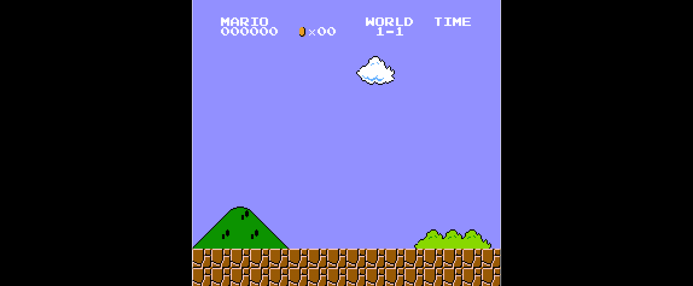

<p align="center">
  <a href="https://prilik.com/ANESE">
    
  </a>
</p>
<p align="center">
  <a href="https://github.com/daniel5151/ANESE/actions?query=branch%3Amaster">
    
  </a>
  <a href="https://ci.appveyor.com/project/daniel5151/anese">
    
  </a>
  <a href="https://travis-ci.org/daniel5151/ANESE">
    
  </a>
</p>

**ANESE** (**A**nother **NES** **E**mulator) is a Nintendo Entertainment System
Emulator written for fun and learning.

Accuracy and performance are long-term goals, but the primary focus is getting
popular titles up and running. There are still a lot of bugs, but many games are
working quite well already.

ANESE is _cross-platform_, and is regularly tested on macOS, Windows, and Linux.

ANESE core uses clean and _interesting_ C++11, emphasizing _readability_,
_maintainability_, and _approachability_. It is well commented, providing
in-line sources and insights for much of the implementation. It is also
dependency free (aside from stdlib), making it easy to embed in other projects.

## WideNES

**wideNES** is a novel technique that can automatically "map-out" levels and
worlds in NES games. Check out the [wideNES Readme](/ANESE/wideNES) for details.

A GIF is worth a 1000 words:

<p align="center">
  
</p>

Pretty cool huh? Here's another one:

<p align="center">
  
</p>

## Downloads

Official releases of ANESE can be found on the Releases tab on GitHub.

Alternatively, for the most up-to-date version of ANESE, nightly builds are
available. These are compiled directly from the latest ANESE commit, so there
may/will be bugs.

**Windows:** You can download builds of ANESE from
[AppVeyor](https://ci.appveyor.com/project/daniel5151/anese)'s build artifacts
page.

**macOS:** Travis uploads ANESE.app bundles to
[this GDrive folder](https://drive.google.com/drive/folders/1GWiinQ4tjDSZlhjReVMdElwK1b-Zvagf).

## Building

### Dependencies

ANESE's emulation core (src/nes) doesn't have any major dependencies, but the UI
does use a couple. Most of these dependencies are bundled with ANESE
(see: /thirdparty), although some require additional installation:

- **SDL2** (video/audio/controls)
  - _Linux_: `apt-get install libsdl2-dev` (on Ubuntu)
  - _MacOS_: `brew install SDL2`
  - _Windows_:
    - Download dev libs from [here](https://www.libsdl.org/download-2.0.php) and
      unzip them somewhere.
    - EITHER: Set the `SDL` environment variable to point to the dev libs
    - OR: Unzip them to `C:\sdl2\` (Where I put them)
    - OR: Modify the `SDL2_MORE_INCLUDE_DIR` variable in `CMakeLists.txt` to
      point to the SDL2 dev libs

### Generating + Compiling

ANESE builds with **CMake**

On macOS / Linux
```bash
# in ANESE root
mkdir build
cd build
cmake ..
make

make install # on macOS: creates ANESE.app in ANESE/bin/
```

On Windows:
```bat
mkdir build
cd build
cmake ..
msbuild anese.sln /p:Configuration=Release
```

## Running

ANESE opens to a directory-browser, from which ROMs can be launched.

ANESE can run from the shell using `anese [rom.nes]` syntax. Certain features
are _only_ accessible from the command-line at the moment (e.g: movie recording
/ playback, PPU timing hacks). For a full list of switches, run `anese -h`

**Windows Users:** make sure the executable can find `SDL2.dll`! Download the
runtime DLLs from the SDL website, and plop them in the same directory as
anese.exe

## Mappers

Most popular Mappers are implemented:

 \#  | Name  | Some Games
-----|-------|--------------------------------------------------
 000 | NROM  | Super Mario Bros. 1, Donkey Kong, Duck Hunt
 001 | MMC1  | Legend of Zelda, Dr. Mario, Metroid
 002 | UxROM | Megaman, Contra, Castlevania
 003 | CNROM | Arkanoid, Cybernoid, Solomon's Key
 004 | MMC3  | Super Mario Bros 2 & 3, Kirby's Adventure
 007 | AxROM | Marble Madness, Battletoads
 009 | MMC2  | Punch Out!!

Feel free to open a PR for any mappers you implement :)

## Controls

Currently hard-coded to the following:

Button | Key         | Controller
-------|-------------|------------
A      | Z           | X
B      | X           | A
Start  | Enter       | Start
Select | Right Shift | Select
Up     | Up arrow    | D-Pad
Down   | Down arrow  | D-Pad
Left   | Left arrow  | D-Pad
Right  | Right arrow | D-Pad

Any xbox-compatible controller should work.

There are also a couple of emulator actions:

Action             | Key                  | Controller
-------------------|----------------------|-------------------------
Pause / Open Menu  | Esc                  | Left Thumbstick Button
Reset              | Ctrl - R             |
Power Cycle        | Ctrl - P             |
Toggle CPU logging | Ctrl - C             |
Speed +25%         | Ctrl - =             |
Speed -25%         | Ctrl - -             |
Fast-Forward       | Space                | Right Thumbstick Button
Make Save-State    | Ctrl - (1-4)         |
Load Save-State    | Ctrl - Shift - (1-4) |

(there are 4 save-state slots)

## DISCLAIMERS

- ANESE is not the best emulator out there, far from it! Expect bugs!
- My APU uses a naive sampling algorithm with a basic lookup table grafted from
the nesdev wiki. The `blargg-apu` branch has an older version of ANESE that uses
Blargg's awesome `nes_snd_emu` library for the APU, and while my integration was
a bit unstable at times, it did sound a lot better when it did work.
- The CPU is _instruction-cycle_ accurate, but not _sub-instruction cycle_
accurate. While this inaccuracy doesn't affect most games, there are some that
that rely on sub-instruction level timings (eg: Solomon's Key).
  - The `--alt-nmi-timing` flag might fix some of these games.

## TODO

These are features that will add major value to ANESE:

- [ ] _Implement_: Cycle accurate CPU (will probably fix _many_ bugs)
- [ ] _Implement_: Better menu (not just fs, also config)
- [ ] _CMake_: more robust macOS bundles (good way to get SDL2.0 packaged?)
- [ ] _Implement_: LibRetro Core
- [ ] _Implement_: Get the Light-gun working
- [ ] _Debugging_: Add debug GUI
  - All objects implementing the Memory interface _must also_ implement `peek`,
    i.e: a `const` read. As such, a debugger could easily inspect any/all memory
    locations with no side effects!

Here's a couple that have been crossed off already:

- [x] _Implement_: My own APU (don't use Blarrg's)
- [x] _Refactor_: Modularize `main.cc` - push everything into `src/ui/`
  - [x] _Refactor_: Split `gui.cc` into more files!
- [x] _Refactor_: Push common mapper behavior to Base Mapper (eg: bank chunking)

And here are some ongoing low-priority goals:

- [ ] _Refactor_: Roll-my-own Sound_Queue (SDL_QueueAudio?)
- [ ] _Cleanup_: Unify naming conventions (either camelCase or snake_case)
- [ ] _Cleanup_: Comment the codebase _even more_
- [ ] _Security_: Actually bounds-check files lol
- [ ] _Cleanup_: Conform to the `.fm2` movie format better
- [ ] _Cleanup_: Remove fatal asserts (?)
- [ ] _Cleanup_: Switch to a better logging system
               (\*cough\* not fprintf \*cough\*)

## Roadmap

### Key Milestones

- [x] Parse iNES files
- [x] Create Cartridges (iNES + Mapper interface)
- [x] CPU
  - [x] Set Up Memory Map
  - [x] Hardware Structures (registers)
  - [x] Core Loop / Basic Functionality
    - [x] Read / Write RAM
    - [x] Addressing Modes
    - [x] Fetch - Decode - Execute
  - [x] Official Opcodes Implemented
  - [x] Handle Interrupts
- [x] PPU
  - [x] Set Up Basic Rendering Context (SDL)
  - [x] Implement Registers + Memory Map them
  - [x] Implement DMA
  - [x] Generate NMI -> CPU
  - [x] Core rendering loop
    - [x] Background Rendering
    - [x] Sprite Rendering - _currently not hardware accurate_
    - [x] Proper Background / Foreground blending
  - [x] Sprite Zero Hit
  - [ ] Misc PPU flags (emphasize RGB, Greyscale, etc...)
- [x] APU
  - [x] Implement Registers + Memory Map them
  - [ ] Frame Timer IRQ - _kinda_
  - [x] Set Up Basic Sound Output Context (SDL)
  - [x] Channels
    - [x] Pulse 1
    - [x] Pulse 2
    - [x] Triangle
    - [x] Noise
    - [x] DMC
  - [x] DMC DMA
- [ ] Joypads
  - [x] Basic Controller
  - [ ] Zapper - _still needs work_
  - [ ] NES Four Score

### Secondary Milestones

- [x] Loading Files with picker
- [x] Reset / Power-cycle
- [x] Fast Forward
- [x] Run / Pause
- Saving
  - [x] Battery Backed RAM - Saves to `.sav`
  - [x] Save-states
    - [ ] Dump to file
- [x] Config File
  - [x] Preserve ROM path
  - [x] Window size
  - [ ] Controls
- [x] Running NESTEST (behind a flag)
- [x] Controller support - _currently very basic_
- [x] A SDL GUI
  - [x] SDL-based ROM picker
  - [ ] Options menu

### Tertiary Milestones (Fun Features!)

- [x] Zipped ROM support
- [ ] Rewind
- [ ] Game Genie
- [x] Movie recording and playback
- [ ] More ROM formats (not just iNES)
- [ ] Proper PAL handling?
- [ ] Proper NTSC artifacting?
- Multiple Front-ends
  - [x] SDL Standalone
  - [ ] LibRetro
- [ ] Debugger!
  - [ ] CPU
    - [ ] Step through instructions
  - [x] PPU Views
    - [x] Static Palette
    - [x] Palette Memory
    - [x] Pattern Tables
    - [x] Nametables
    - [ ] OAM memory

### Accuracy & Compatibility

- More Mappers! Always more mappers!
- [ ] Add automatic testing
  - [ ] Screenshots: compare power-on with 30 seconds of button mashing
  - [ ] Test ROMs: Parse debug outputs
- CPU
  - [ ] Implement Unofficial Opcodes
  - [ ] Pass More Tests
  - [ ] _\(Stretch\)_ Switch to sub-instruction level cycle-based emulation
        (vs instruction level)
- PPU
  - [x] Make the sprite rendering pipeline more accurate (fetch-timings)
  - [ ] Pass More Tests
  - [ ] Make value in PPU <-> CPU bus decay?

## Attributions

- A big shout-out to [LaiNES](https://github.com/AndreaOrru/LaiNES) and
[fogleman/nes](https://github.com/fogleman/nes), two solid NES emulators that I
referenced while implementing some particularly tricky parts of the PPU). While
I actively avoided looking at the source codes of other NES emulators while
writing my initial implementations of the CPU and PPU, I did sneak a peek at how
others solved some problems once I got stuck.
- These awesome libraries are used throughout ANESE's UI and in WideNES:
  - [cfg_path](https://github.com/Malvineous/cfgpath) - cross-platform config file
  - [clara](https://github.com/catchorg/Clara) - argument Parsing
  - [cute_headers](https://github.com/RandyGaul/cute_headers/) - cross-platform directory browsing
  - [miniz](https://github.com/richgel999/miniz) - zipped ROM support
  - [sdl2](https://www.libsdl.org/) - A/V and Input
  - [SDL_inprint](https://github.com/driedfruit/SDL_inprint/) - SDL fonts, without SDL_ttf
  - [simpleini](https://github.com/brofield/simpleini) - ini config parsing / saving
  - [stb](https://github.com/nothings/stb) - image loading / writing
