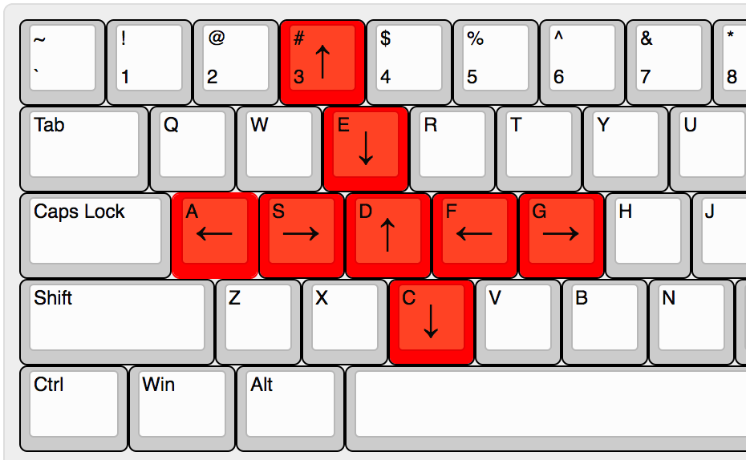

# WideNES

Unlike many modern titles, NES games generally lacked "world maps" or "level
viewers." If you wanted to map-out the a level, you had to do it manually,
drawing a map by hand, or stitching together a bunch of screenshots.

That's a lot of work.

Wouldn't it be cool to automate that?

Enter [**wideNES**](http://prilik.com/blog/wideNES), a novel method to map-out 
NES games automatically.

  

Pretty cool huh? Here's another one:

  

## Enabling wideNES

You can enable wideNES by passing the `--widenes` flag from the command-line.

## Things that need improving:

- Better heuristics!
  - detecting scene transitions
  - detecting scrolling modes
  - detecting padding
- Stitching together scenes - manually and automatically
- A GUI
- Performance
- Better tile-recording (scan PPU RAM?)

## Controls

wideNES inherits all controls from ANESE, and adds a few additional ones:

#### Pan and Zoom

You can **pan** and **zoom** using the mouse + mousewheel.

#### Padding controls

wideNES has many built-in heuristics that are used to "guess" what parts of the
screen are not part of the level (i.e: status bars / leave artifacts), and while
these work pretty well, there are times some manual tweaking might be preferred.

 Side   | increase | decrease
--------|----------|-------
 Left   | s        | a
 Right  | d        | f
 Top    | e        | 3
 Bottom | d        | c

(hold shift for fine-grained control)

The keys make more sense when laid out visually:

## How does this work?

The NES's PPU (graphics processor) supports _hardware scrolling_, i.e: there is
a specific register, 0x2005 - PPUSCROLL, that games can write to and have the
entire screen scroll by a certain amount. wideNES watches the scroll register
for changes, tracking how much those values change between frames, and uses
those deltas to intelligently "sample" the framebuffer. As the player gradually
explores more of the game, more and more of the map is revealed, and in turn,
recorded.

It's not quite _that_ simple, since there are lots of additional heuritics that
are used to smooth out edge-cases, but at a high level, that's the gist of it!

If you're really interested in the gory details, check out the writeup on
[my blog!](http://prilik.com/blog/wideNES)

## Caveats

wideNES works surprisingly well with many games out of the box, but it's no
magic bullet, and can sometimes fail.

#### Scene Detection

It's hard to detect when a scene-transition occurs...

The approach wideNES uses relies on taking a perceptual-hash of the scene every
frame, and watching for sudden spikes in the delta of perceptual hashes between
frames. There is a lot of work left to make this system robust, since
false-calls can (and do) happen.

#### Custom Scrolling implementations

While many games conform to the standard way of scrolling the screen, there are
some games that opt to use unorthadox scrolling strategies. These cases require
manual exploration, and probably require new heuristics to be developed.

For example, take _The Legend of Zelda_. Although it does use the scroll
register when performing left-and-right screen transitions, it uses a custom
technique to do up-and-down screen transitions, writing to PPUADDR instead of
the more common PPUSCROLL.

I have implemented a heuristic that has _The Legend of Zelda_ kind-of working,
but it involved a non-trivial amount of work sniffing memory values and such.
Moreover, I have not tested enough games to confidently say the heuristic is
game-agnostic (although it is written quite generally)

There are undoubtedly other examples of games that do not work, but feel free to
file an issue and I might dig into them. Alternatively, PR's are always welcome!

#### Sprites as Background Elements

At the moment, wideNES only builds up the map using the background layer,
ignoring all sprites. That means any sprites that are _thematically_ part of the
background are ignored.

#### Non-euclidean levels

wideNES assumes that if you go in a circle, you end up where you started.
Most games follow this rule, but there are exceptions. Ex: the Lost Woods in
_The Legend of Zelda_.

I haven't looked into this yet, so I cannot be sure if there is a work-around.

## Core Roadmap

- [x] avoid smearing in some games
- [x] mask-off edges (artifacting / static menus)
  - [x] manually - _see controls_
  - [x] automatically - _using heuristics_
    - [x] bgr mask (many games)
    - [x] MMC3 IRQ (SMB3, M.C Kids)
    - [x] mid-frame PPUADDR changes (TLOZ)
    - [ ] scrolling/mirroring mode mismatch
    - ...
- [x] Handle some "non-traditional" scrolling methods
  - [x] _The Legend of Zelda_
- [x] Remembering what's been seen
  - [x] Recognize scene-changes
    - using _very_ basic perceptual hashing, needs work
  - [x] Scene change -> finds scene if exists
  - [x] Save/Load tiles / scenes
- [ ] Animated background / tile support?

